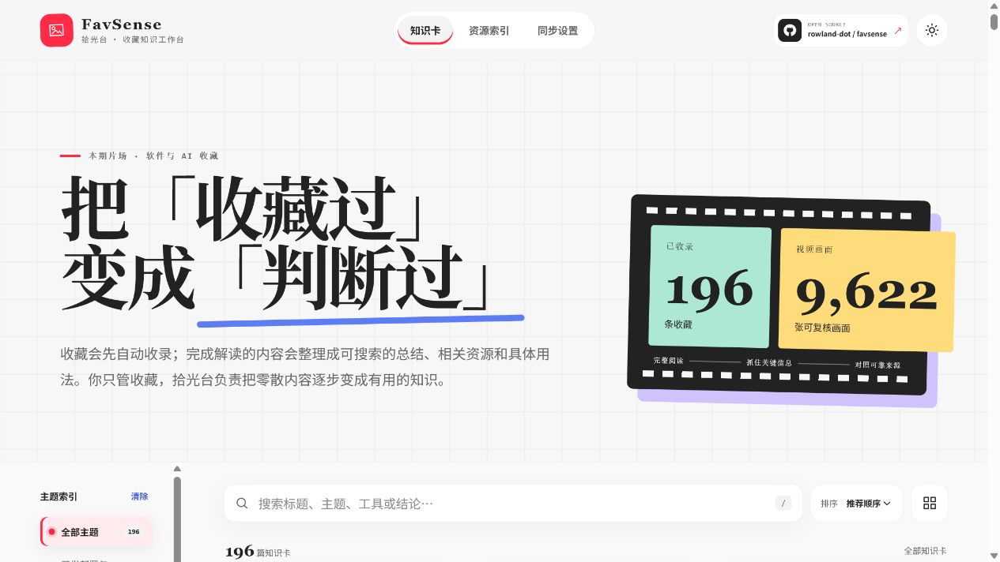

# FavSense · 拾光台

> Make sense of what you save.

FavSense 是一套本地优先、可独立运行的小红书 / RedNote 收藏整理引擎：由用户主动同步收藏，通过视频画面分析识别短暂出现的信息，再生成可搜索、可追溯、可行动的知识库、资源索引与 Obsidian 笔记。

**Automated Xiaohongshu / RedNote favorites organizer with video analysis, a domain-aware resource index, Obsidian output, and a deployable static knowledge-base UI.**



它不是一组需要每天打开的 Markdown 文件，而是一条本机按需同步、确定性整理、静态网页阅读的完整链路。公开网页可以零后端部署到 GitHub Pages 或 Hugging Face Static Spaces。

项目由两层组成：

- **本地私有层**：FavSense 复用相邻 `SOP - 小红书` 项目唯一的扫描浏览器、动态 CDP 通道和其中的 Tampermonkey；临时本地服务负责用户主动发起的只读同步。FavSense 不创建第二个 profile，也不借用主浏览器；Cookie、临时 Token、原始视频和个人收藏配置不进入 Git。
- **公开展示层**：零后端静态网页展示原创总结、领域资源、权威来源和下一步行动，可免费部署到 Hugging Face Static Space。

## 网页功能

- 视觉化知识卡，不需要每天打开一堆 Markdown；
- 全文搜索，以及由当前领域定义的内容形态筛选；software 示例使用 Skill/Tool/Workflow/Product，其他领域使用自己的标签；
- “同步设置”页首屏列出全部收藏夹，可用独立开关决定整理范围，并通过“开始整理”按钮主动触发；每轮会先同步收藏夹改名和新增收藏夹，再读取正文与可用的匿名评论区线索；
- 单篇详情抽屉，集中显示深度总结、行动建议和相关资源；
- 知识卡书签、只看书签，以及只显示书签关联资源；
- 可在详情中修订知识卡描述，并随时恢复系统版本；
- 个人书签与修订默认保存在浏览器；HF 登录后同步到用户自己的私有 Dataset，无需 Docker；
- 可配置资源索引：software 归类开源项目、网站、文档与教程，fitness 显示训练资料，skincare 显示成分与使用边界；
- 深色模式、响应式移动端与键盘操作；
- 公开网页不包含登录态、个人主页、收藏夹 ID、视频文件或帧图片。

## 推荐：让 Agent 直接安装

推荐使用能够操作本机终端和文件的 coding Agent 完成安装，例如 **Codex、Claude Code**，或其他遵循 `AGENTS.md` / `CLAUDE.md` 的 Agent。这样 Agent 可以自动检查依赖、复制公开配置模板、运行安装入口并执行发布检查，用户不需要逐条搬运命令。

把下面这段话直接交给 Agent：

```text
请安装并配置这个仓库中的 FavSense。先完整阅读 AGENTS.md 和
skills/xhs-favorites-organizer/SKILL.md，遵守隐私与只读边界；检查 Windows、
Node.js、Git、uv、Google Chrome 和 Tampermonkey 依赖；根据示例创建我的私有配置，
引导我只填写无法自动发现的主页与收藏夹信息；运行 favsense.ps1 setup，
完成测试并启动本地预览。不要读取、输出或提交 Cookie、Token、收藏夹 ID、
原始视频、抽帧或 knowledge-base。遇到验证码、300031 或访问频繁立即停止。
```

Agent 能完成本机环境检查和配置；出于浏览器安全边界，首次扫码登录、Tampermonkey 的最终安装确认和“开始整理”按钮仍由用户在 SOP 扫描浏览器或本地工作台中操作。安装后的同步、去重、知识库构建和网页生成均独立运行，不依赖 Codex、Claude 或任何模型服务，也不会创建每日或开机整理任务。

## 快速预览

仓库已经包含经过脱敏的演示数据。Node.js 20+ 环境直接运行：

Windows 用户可以直接双击项目根目录的 `Start-FavSense.cmd`。启动器会运行本地桥接与网页服务，确认网页就绪后自动打开默认浏览器；关闭启动窗口即可停止服务，不会创建计划任务或开机启动项。

命令行入口为：

```powershell
npm run preview
```

然后打开 `http://127.0.0.1:8766`。不要直接双击 `index.html`，浏览器会阻止读取 JSON 数据。

发布前统一执行：

```powershell
npm run release:check
```

## 配置自己的收藏同步

要求：Windows、Google Chrome、Tampermonkey、Node.js 20+、Git、[uv](https://docs.astral.sh/uv/)，以及相邻的 `SOP - 小红书` 项目。setup 会用 uv 在 `.xhs-tools/` 中隔离准备 Python 3.12 和固定版本的详情读取器，不修改全局 Python 环境。SOP 的扫描浏览器是唯一的小红书登录浏览器；FavSense 只读取 SOP 的私有端口登记并在该浏览器中创建临时标签，不创建第二个 profile，也不借用主浏览器。

```powershell
Copy-Item ".\config\xhs-favorites.example.json" ".\config\xhs-favorites.json"
```

编辑私有配置中的个人主页并提供至少一个初始收藏夹。首次及以后每轮整理都会从个人收藏页自动补齐新增收藏夹并同步名称变更。

`published_since` 控制深度处理的内容发布日期下限，格式为 `YYYY-MM-DD`。媒体下载、音频转写和按需视觉分析使用这一范围；它不会从知识库或网页中隐藏 catalog 已保存的历史收藏。示例默认从 `2026-01-01` 开始。

先完成下面的同步 setup；它会准备离线转写所依赖的固定版本 Python 运行时。

```powershell
powershell.exe -NoProfile -ExecutionPolicy Bypass -File `
  ".\skills\xhs-favorites-organizer\scripts\setup-autosync.ps1" `
  -Workspace "." -Config ".\config\xhs-favorites.json" `
  -SopRuntime "..\SOP - 小红书\运行系统"
```

安装命令不会创建 Windows 每日任务或开机启动项；升级时会删除旧版 `FavSense-Daily` 任务。`-SopRuntime` 省略时会按上述相邻目录自动解析。setup 先复用已经运行的 SOP 扫描浏览器；若通道未启动，只允许调用 SOP 自己的 `启动扫描浏览器.bat` 一次。首次运行时，它在同一个 SOP 窗口中打开 Tampermonkey 官方商店页和小红书登录页。请在该窗口安装扩展并扫码登录，然后再次运行同一条 setup 命令。

只有检测到 SOP 扫描浏览器的 profile 已安装 Tampermonkey 后，setup 才会先核对并准备已审查提交 `d805ebdd3db53f68137bc2b7a6ed118ce572d09b` 的 XHS-Downloader 运行时。下载、锁文件安装或版本核对失败会在生成 Bridge token 和十分钟安装能力之前停止；已有但版本不符或工作树包含修改或未跟踪文件的 checkout 不会被覆盖。运行时就绪后，setup 才启动本机服务，并通过同一个动态 CDP 通道打开用户脚本安装页。不要保存或分享该临时地址；不要把主浏览器 profile 或 Cookie 复制到任一项目。

在 Tampermonkey 安装页确认安装后，运行本地工作台，在“同步设置”中选择收藏夹并点击“开始整理”。只有这次点击会让桥接服务在 SOP 扫描浏览器中新建业务标签并开始读取；关闭工作台后本地桥接服务会停止，但 SOP 浏览器仍由用户持有并保持登录。

视频整理默认使用“音频优先、视觉按需升级”。setup 完成后，首次启用离线转写：

```powershell
powershell.exe -NoProfile -ExecutionPolicy Bypass -File `
  ".\skills\xhs-favorites-organizer\scripts\setup-transcription.ps1" `
  -Workspace "." -Model small
```

之后可以批量处理待整理视频：

```powershell
powershell.exe -NoProfile -ExecutionPolicy Bypass -File `
  ".\skills\xhs-favorites-organizer\scripts\run-video-analysis.ps1" `
  -Workspace "." -Config ".\config\xhs-favorites.json" -MaxItems 20
```

工作任务默认先离线转写音频，不自动批量抽帧。长视频按可续跑时间窗处理：只要语音已经说出 Skill、仓库或所缺事实，就立刻停止剩余音频并进入官方核验；仍有缺口才继续下一段。只有语音没有给出明确名称、音频过少或讲解明确要求查看屏幕时，才在复核转写后追加 `-PrepareVisualEvidence`。该开关每次只处理一个条目的一个 30 秒低密度画面窗口，并受总帧数、磁盘字节和执行时间三重预算约束；找到目标后不再检查余下画面，未找到才从记录的下一个时间点继续。每 0.5 秒抽帧只用于仍未解决的局部时间段。临时 WAV 默认在转写后删除，原视频、转写和帧始终保留在 Git 忽略的私有目录中。

私有配置显式开启 `diandian.enabled` 并加载 v1.2 CDP transport 后，仍然只需这一个按钮：系统先完成确定性的同步、去重和构建，再由 Tampermonkey 为每篇笔记分享并复制一次临时签名链接；本机 Bridge 只在内存中核对该链接，随后通过 SOP 动态 CDP 通道在同一个扫描浏览器中新建空白目标页。外部 Skill 的 `ask(session, plain_note_url, spec=...)` 负责真实鼠标聚焦和原生输入，Bridge 负责导航、登录/验证码/`300031`/频率限制检查、严格的新回复与稳定性证明、私有保存确认以及成功后的关页。任一步失败都会保留诊断页并停止当前及剩余批次，不重试轰炸，也不伪造总结。点点回复经过逐篇质量门、评论检查、资源核验和内容哈希绑定后才可能进入公开站点。

`diandian.skill_path` 指定点点单篇总结 Skill 的安装目录，开启点点时必须显式填写。公开配置模板指向仓库随附的 `skills/xhs-diandian-summarize-note`；也可以在 Git 忽略的私有配置中填写一个版本化的本机绝对路径，把 Skill 作为独立知识资产管理。桥接会核对 `SKILL.md`、`release.json`、`runtime/browser-contract.json`、API 1 保存器，以及 v1.2 精确声明的 `scripts/cdp_transport.py` 和 `ask` 签名。v1.1 可被旧链路兼容加载，但不会暴露本机 CDP“重新总结”能力；路径、版本、transport 或契约错误时会 fail closed，不会从网页内容动态加载可执行路径。

Tampermonkey 脚本含本机桥接凭据与收藏夹映射；请关闭该脚本的云同步与导出分享。若曾同步或导出，重新运行 setup 并重装脚本以轮换凭据。

Windows 用户也可以使用统一入口：

```powershell
.\favsense.ps1 setup
.\favsense.ps1 preview
.\favsense.ps1 stop
.\favsense.ps1 verify
```

“开始整理”会自动生成 Obsidian 知识库和公开网页数据。命令行备用入口为：

```powershell
powershell.exe -NoProfile -ExecutionPolicy Bypass -File `
  ".\skills\xhs-favorites-organizer\scripts\run-daily.ps1" -Mode daily

node ".\skills\xhs-favorites-organizer\scripts\build-public-site.mjs"
```

主动整理本身不依赖 Codex、Claude 或其他 Agent。Agent 只作为可选的二次策展者，并统一读写项目内的开放 JSON/Markdown 数据。

本地卡片的“打开原帖”会把稳定笔记 ID 交给桥接服务，由 Bridge 在现有 SOP 扫描浏览器中打开来源收藏夹，再使用当前页面的实时签名精确定位原帖；本地工作台不会在主浏览器另开小红书标签。公开/Hugging Face 页面不保存签名链接，因此显示安全的“在小红书搜索原帖”入口。

网页中的收录数、深度解读数、可复核画面数和资源数不是手工展示值：构建器从当前 catalog、`.xhs-favorites/video-analysis/` 的本机证据文件以及领域资源注册表重新计算。每次主动整理完成后都会重建网页数据；画面路径和原始文件不会进入公开 JSON。

`setup-autosync.ps1` 会为本机网页生成 Git 忽略的 `site/.local/bridge.json`，其中只有回环服务地址，不包含 token。“开始整理”和收藏夹开关只在本机工作台显示；部署到 GitHub 或 Hugging Face 后不会获得本机触发能力。关闭收藏夹只停止后续采集，不会删除已经整理的知识卡。

## 小红书来源与领域配置

当前采集适配器只连接小红书：SOP 扫描浏览器中的 FavSense 用户脚本读取你有权访问的收藏面板，本地桥接服务增量去重并重建知识库。采集层不包含软件、GitHub 或健身规则。

`config/xhs-favorites.json` 通过两个路径决定整理方式：

- `domain_profile`：领域分类、内容形态、首页叙事和资源索引接口；
- `curation_file`：逐篇人工策展与自动判断覆盖。

主分类默认直接继承用户自己的收藏夹，因此新部署不会显示演示站的主题标签。收藏夹可以用可选的 `category` 映射展示名称；同一笔记进入多个收藏夹时，`category_priority` 较高者优先。内容规则发现更合适的分类时，只在详情页显示建议，并独立纳入搜索；只有策展数据同时写入 `"category_override": true` 和 `category_reason`，才会真正跨收藏夹移动主分类。领域若明确需要旧式内容优先行为，可以把 `classification.category_strategy` 改为 `content-first`。

仓库提供 software、fitness 与 skincare 三个领域模板。当前公开演示使用 software；切换领域不会改变小红书登录、同步、去重和隐私边界。

内容形态不是 FavSense 的全局固定枚举，而是 `domain_profile.content_kinds` 的领域接口：software 可使用 `Tool / Skill / Workflow / Product`，fitness 使用 `Movement / Program / Claim / Product`，skincare 使用 `Ingredient / Routine / Claim / Product`。网页筛选器直接读取当前构建结果中的 `meta.kindLabels`，不会把 software 标签带入健身或护肤知识库。创建新领域时必须同时定义 `classification.default`、分类规则和内容形态说明；未深度解读不等于 `Note`。

## 发布到 GitHub

先确认私有文件均显示为 ignored：

```powershell
git status --short --ignored
node --test ".\skills\xhs-favorites-organizer\tests\test_public_site.mjs"
```

然后创建 GitHub 仓库并推送：

```powershell
git add .
git commit -m "Initial open-source release"
git branch -M main
git remote add origin https://github.com/YOUR_USERNAME/favsense.git
git push -u origin main
```

发布目标已配置为 `https://github.com/rowland-dot/favsense`，网页右上角会显示“开源项目”入口。在 Hugging Face 也可以创建公开 Space Variable `GITHUB_REPOSITORY_URL` 覆盖它，无需改代码。

同一配置中的 `creatorGitHubUrl` 和 `creatorName` 控制右上角作者空间入口；开源使用者替换这两个字段即可指向自己的 GitHub。没有配置有效 GitHub 地址时，入口自动隐藏，不会产生失效链接。

提交前务必检查 staged diff；不要使用 `git add -f` 强行加入 `.xhs-favorites/`、`knowledge-base/` 或私有配置。

## 发布到 Hugging Face Spaces

Hugging Face 不是只有项目介绍页：FavSense 会把 `site/` 作为完整、可交互的公网知识库发布。小红书登录、采集、视频证据和 Obsidian 完整库留在本机；用户主动整理完最后一个已启用收藏夹后，可把新的脱敏网页数据同步到 Space。

```json
{
  "publish": {
    "enabled": true,
    "provider": "huggingface",
    "repository": "https://huggingface.co/spaces/YOUR_HF_USERNAME/YOUR_SPACE_NAME",
    "branch": "main"
  }
}
```

发布 Token 不写入配置或仓库，由系统 Git 凭据管理器保存。默认使用 Static HTML SDK，完整支持搜索、筛选、详情、书签、个人修订和资源索引，不需要 Docker、Python 服务或 GPU。个人数据通过 HF OAuth 的最小 `contribute-repos` 权限写入当前用户自己的私有 Dataset；OAuth 临时凭据不会进入 FavSense 仓库。首次发布、主动整理后的发布、数据保存位置和故障排查见 [完整发布指南](docs/PUBLISHING.md)。

1. 在 Hugging Face 选择 **Create new Space**。
2. SDK 选择 **Static HTML**，可见性由你决定。
3. 创建后，把同一仓库推送到 Space：

```powershell
git remote add space https://huggingface.co/spaces/YOUR_HF_USERNAME/YOUR_SPACE_NAME
git push space main
```

根目录 README 已配置 `sdk: static`、`app_file: site/index.html` 和 HF OAuth，因此 Space 不需要 Python 服务、容器或付费硬件。部署后在“同步设置 → 个人数据”登录 HF，即可跨设备同步书签和知识卡修订。

更完整的发布与更新流程见 [docs/PUBLISHING.md](docs/PUBLISHING.md)。

## 仓库结构

```text
site/                                 公开静态网页与脱敏数据
skills/xhs-favorites-organizer/       跨 Agent、可独立运行的同步 Skill
config/xhs-favorites.example.json     可公开的配置模板
config/xhs-favorites.json             本机私有配置（Git 忽略）
.xhs-favorites/                       私有 catalog、原始视频和分析画面（Git 忽略）
knowledge-base/                       本机 Obsidian 输出（Git 忽略）
scripts/                              零依赖预览与发布检查
.github/                              CI、Issue、PR 与 Pages 模板
AGENTS.md / CLAUDE.md                 跨 Agent 的安全协作规则
```

## 通用资源索引

同一页面组件由 `domain_profile.resource_index` 驱动。software 同时归类开源项目、官方网站、官方文档、教程与参考资料；fitness 把实体定义为训练资料；skincare 把实体定义为成分与方案。三个模板共用搜索、类型筛选、配置化排序和来源入口，页面中没有 GitHub 或 Star 的固定字段。排序是资源类型的二级能力：例如 Star 排序只在“开源项目”中出现。完整接口与 Agent 自动搭建规则见 [资源索引领域接口](docs/RESOURCE_INDEX.md)。

## 文档

- [发布到 GitHub、Pages 与 Hugging Face](docs/PUBLISHING.md)
- [系统架构与信任边界](docs/ARCHITECTURE.md)
- [资源索引领域接口](docs/RESOURCE_INDEX.md)
- [路线图](ROADMAP.md)
- [贡献指南](CONTRIBUTING.md)
- [安全政策](SECURITY.md)

## 安全与合规边界

- 只处理本人有权访问的收藏和公开内容；不点赞、不评论、不发布、不取消收藏。
- 不绕过验证码、安全限制或平台风控。
- FavSense 代码不读取、导出、复制、打印或提交 Chrome Cookie；登录态只由 Chrome 自身保存在 SOP 项目 Git 忽略的扫描 profile 中。
- 小红书内容版权属于原作者；公开演示只包含链接、必要元数据和本项目原创总结，不发布下载的视频或抽帧图片。
- GitHub Star 是核验日期当时的快照，不代表安全性或推荐结论。

## 贡献与许可证

项目采用 [MIT License](LICENSE)。提交改进前请阅读 [CONTRIBUTING.md](CONTRIBUTING.md) 和 [SECURITY.md](SECURITY.md)。
