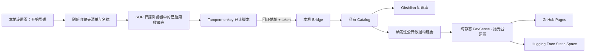

# 架构说明

FavSense · 拾光台把“使用者的私有采集环境”和“可以公开部署的阅读界面”严格分开。用户主动触发的同步不依赖 Codex、Claude 或任何特定 Agent。

## 两条信任边界

### 本地私有层

包含个人收藏夹配置、随机 bridge token、去重 catalog、原始媒体、视频分析画面与本地工具。它们都在 `.gitignore` 中，服务只监听 `127.0.0.1`。浏览器登录态唯一保存在相邻 `SOP - 小红书` 项目的私有扫描 profile 中：SOP 拥有 Chrome 进程、profile 与动态端口登记，FavSense 只消费该 CDP 通道并管理自己创建的临时标签；它不读取 Cookie、不创建第二个 profile，也不回退到主浏览器。

“同步设置”页的 `.local/bridge.json` 只保存回环服务地址。Bridge 只接受固定工作台 Origin `http://127.0.0.1:8766` 的浏览器请求；公共托管没有该文件，因此既不显示触发按钮，也不具备本机控制能力。这里的 Origin 检查是浏览器边界，不是操作系统用户身份认证：回环端口对同机进程可见，当前本地控制面只支持由同一位受信任用户独占的工作站，不应在多用户共享主机或不受信任的本机进程环境中运行。启动页与 Bridge 返回的数据仍必须经过严格 schema 校验，不能把回环响应当成可信 HTML。

### 公开展示层

`site/` 只包含原创摘要、公开原帖链接、必要元数据和经过核验的资源信息。它不需要后端、数据库、GPU 或构建框架，可以直接由任意静态托管服务发布。

## 数据流

1. 用户脚本先在个人收藏页发现收藏夹；本地桥接按稳定 ID 合并改名和新增项，再只扫描当前启用且可见的收藏夹。
2. 详情适配器在同一次只读页面请求中提取正文与页面初始评论；评论去除用户身份后作为未经核实的补充线索保存，原始评论不进入公开网页。
3. Bridge 校验 Host、token、面板 ID、请求大小和小红书 URL。
4. 新笔记按 ID 增量去重；失败条目单独记录，不循环重试。
5. 构建器从私有 catalog 生成 Markdown 与脱敏 `site/data/knowledge.json`。
6. 网页在浏览器中完成搜索、筛选、排序和详情展示。

## 领域层与资源索引

采集来源和知识领域分离：小红书适配器只负责获取收藏，`domain_profile` 负责内容分类、页面叙事与资源索引。构建器把不同领域注册表编译为统一的 `resources` 结构，前端再读取领域配置提供的实体字段、分组筛选、排序、指标和权威入口。software、fitness 与 skincare 已共用这条链路，接口见 [资源索引领域接口](RESOURCE_INDEX.md)。

## 关键设计决策

- 纯静态公开站点：部署轻、成本低，也缩小了公开攻击面。
- 确定性构建器：相同输入产生相同结构，不把每日运行绑定到某个模型供应商。
- 原始证据留在本机：公开知识可以分享，账号登录态和版权材料不随之发布。
- 收藏夹优先建立主分类：默认直接反映用户自己的收藏体系；内容识别负责主题关联和纠偏建议，只有带依据的显式覆盖才跨收藏夹归档。
