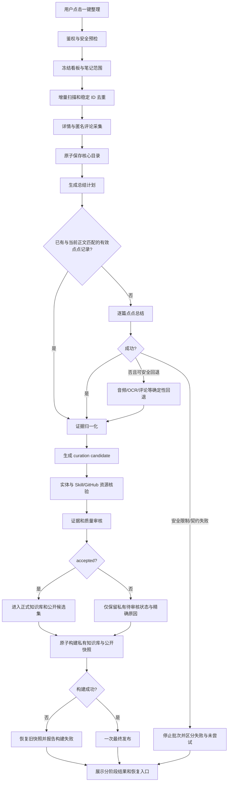

# FavSense 收藏整理端到端闭环与回归修复 Spec

> 状态：**APPROVED — 用户已批准**
> 版本：v1.0
> 日期：2026-08-22
> 批准日期：2026-08-22
> 适用范围：小红书收藏整理、点点总结、Skill/GitHub 资源核验、私有知识库、公开网页、本地工作台与发布流程
> 实施授权：**无**。本文件获批前，不修改生产代码、配置、测试或发布内容。
> 审批后的唯一执行入口：`/dev-pipeline plan..brief`

---

## 1. 为什么需要这份 Spec

用户当前看到的两个核心故障是：

1. 大量笔记显示“当前未展示点点总结”；
2. Skill 卡片没有形成可靠的总结、GitHub 官方仓库和 ZIP 下载入口。

这不是一个孤立的渲染问题，而是采集、总结、证据、策展、资源核验、构建、发布和状态反馈之间没有形成完整闭环。当前代码里的严格公开门槛在保护内容质量，但上游自动流程没有生产满足门槛所需的全部数据；下游界面又把多个不同失败状态压成同一句兜底文案。

本 Spec 定义：

- 系统应当怎样从用户点击“一键整理”走到可验证的最终结果；
- 每个阶段的数据契约、状态、失败边界与恢复方式；
- 当前实现与正确逻辑之间的具体差距；
- 按依赖顺序修复并验证闭环的方法；
- 今后所有修改必须遵循的 `Spec → Plan → TDD → QA → PR` 治理门。

## 2. 当前事实快照与直接结论

以下数字是 2026-08-22 对当前工作区的只读审计快照，只用于说明现状，不得硬编码进产品逻辑：

| 项目 | 当前结果 | 含义 |
|---|---:|---|
| 公开笔记 | 255 | 当前公开数据集规模 |
| 点点来源 | 2 | 只有 2 条满足公开点点门 |
| curation 来源 | 83 | 由已发布策展内容提供 |
| source-metadata 来源 | 170 | 使用元数据兜底，并显示“当前未展示点点总结” |
| 公开 Skill 卡片 | 56 | 当前 `kind=Skill` 数量 |
| Skill 中点点来源 | 0 | 所有当前 Skill 都没有公开点点来源 |
| Skill 中匹配资源 | 19 | 只有 19 条关联到资源注册表 |
| Skill 中无匹配资源 | 37 | 无法生成可信 GitHub/ZIP 动作 |
| 资源条目 | 78 | 当前资源注册表规模 |
| 同时有仓库与 ZIP | 66 | 数据存在，但笔记详情通常只显示第一个动作 |
| 私有有效点点记录 | 5 | 已保存的私有点点结果 |
| 点点未解决记录 | 43 | 其中大量记录被同一次中止批量标记 |

直接结论：

- 用户感知“所有笔记都没有点点总结”有明确数据基础：253/255 条公开笔记不是点点来源，170/255 条显示精确兜底文案；56 条 Skill 中 0 条是点点来源。
- GitHub/ZIP 并非从每篇 Skill 自动提取，而是依赖 `entry.tools` 与静态资源注册表精确匹配。37/56 条 Skill 没有匹配资源。
- 即便资源同时具有官方仓库和 ZIP，笔记详情当前也只选取第一个安全动作，因此通常只显示仓库而隐藏 ZIP。
- 当前完整测试命令全部通过，但这些测试没有断言端到端用户结果。这是需求覆盖缺口，而不是“测试没运行”。

## 3. 目标、非目标与不可破坏边界

### 3.1 目标

1. 用户主动点击一次整理后，系统能够独立于 Codex、Claude、Gemini 完成核心采集、去重、知识库构建和网页构建。
2. 每条进入本次冻结范围的合格笔记都有明确、可恢复、可解释的总结状态，不再被统一压成模糊文案。
3. 点点结果按笔记原子保存；已有效保存的结果不重复处理；中断后可从未完成项继续。
4. 未审核内容可在本机安全查看其“待审核证据”，但不能冒充已通过的正式总结进入公开内容。
5. 只有经过实体和资源核验的内容才能公开标记为 `Skill`；每个公开 Skill 必须具有经过验证的官方仓库和安全下载动作。
6. 最终构建、发布和 UI 状态必须真实反映各阶段结果；不能用“整理完成”掩盖总结、构建或发布失败。
7. 任何失败都保留已经成功的核心收藏数据和上一个可用公开版本。
8. 用端到端验收测试锁定上述用户结果，使“测试全绿但用户结果损坏”不能再次发生。

### 3.2 非目标

- 不绕过验证码、访问频繁、`300031` 或其他平台安全限制。
- 不自动点赞、评论、发布、取消收藏或修改平台数据。
- 不创建每日、开机或后台常驻整理任务。
- 不把 Agent 变成核心运行依赖；Agent 只能是可选策展层。
- 不猜测 GitHub 仓库、不为不确定实体生成看似可信的下载链接。
- 不把 Cookie、`xsec_token`、bridge token、个人主页、收藏夹 ID、原始视频或帧证据写入日志、Spec、测试夹具或公开目录。
- 本 Spec 不直接授权实现、提交、推送、部署或合并。

### 3.3 系统不变量

以下条件在所有实现阶段都必须成立：

- **用户触发**：没有用户动作就不开始采集或整理。
- **只读采集**：对小红书只读取，不产生互动写操作。
- **安全即停**：遇到安全限制立即终止当前自动化，不重试、不绕过。
- **核心独立**：核心同步和去重不依赖任何大模型服务。
- **分层可信**：原始证据、待审核候选、已接受内容和公开内容不可混为一层。
- **逐条原子**：每条点点结果成功后立即保存；后续失败不能抹掉已保存结果。
- **版本一致**：总结与审核必须绑定当前正文哈希；正文变化使旧审核失效，但保留历史记录。
- **Skill 必有资源**：公开 `kind=Skill` 必须关联已核验的唯一资源；否则只能是候选类型。
- **公开最小化**：公开输出只含安全、已接受、可追溯的数据。
- **旧版可用**：构建或发布失败时保留上一个成功快照。
- **状态不撒谎**：总体状态由阶段状态推导，不能覆盖或隐藏失败。

## 4. 术语与可信层级

| 术语 | 定义 |
|---|---|
| Core record | 从收藏页和详情页获取、去重并保存的核心笔记记录 |
| Raw evidence | 私有保存的正文、匿名评论、点点输出、音频/OCR 结果等证据 |
| Candidate | 由确定性流程生成、尚未通过语义与资源审核的策展候选 |
| Accepted curation | 已满足当前正文哈希、证据方法、未解决事实、资源等门槛的正式策展记录 |
| Public snapshot | 只包含可公开数据的原子构建产物 |
| Confirmed Skill | 已确认项目身份并通过官方资源核验的 Skill |
| Skill candidate | 可能是 Skill，但项目身份或资源尚未核实；不得公开标记为 `Skill` |
| Frozen run scope | 本次运行启动时冻结的目标集合，运行中新增收藏不偷偷加入 |

可信层级必须保持单向提升：

```text
平台输入（不可信）
  → 私有核心记录
  → 私有证据
  → 待审核候选
  → accepted curation
  → 私有正式知识库 / 公开快照
```

任何下游失败都不得反向删除上游已成功、已验证的数据。

## 5. 正确的端到端系统闭环



### 5.1 阶段 A：本地启动与安全预检

**Entry**：用户在本地工作台点击“一键整理”或“重新整理此篇”。
**Action**：验证 loopback 地址、origin、host、bridge token、请求大小、浏览器运行状态和安全停止哨兵；复用指定 SOP 浏览器，不创建第二个资料目录。
**Expected result**：生成唯一 `run_id`，记录配置快照和开始时间；公开网页无法触发本地控制接口。
**Failure**：鉴权或预检失败时不启动任何采集，并显示具体安全原因。

### 5.2 阶段 B：发现、范围冻结与增量扫描

**Entry**：安全预检通过。
**Action**：先发现全部收藏看板，合并改名和新增看板，保留暂时不可用看板；根据配置冻结本次启用看板和单篇目标。使用稳定笔记 ID 去重，正常模式扫描到稳定边界，历史模式遵守硬上限。
**Expected result**：产生不可变的 `frozen_scope`，明确 `new/changed/unchanged/missing` 数量。
**Failure**：发现或扫描发生平台安全信号时进入 `safety_stopped`，不循环重试。

### 5.3 阶段 C：详情、评论与核心目录事务

**Entry**：冻结范围中的新增、正文变更、损坏或评论未检查笔记。
**Action**：以只读方式抓取详情和最多允许数量的匿名评论；用稳定 ID 合并目录；先写 staging，再交换 live。
**Expected result**：核心目录、分类索引和本地恢复点原子更新；已有记录不重复。
**Failure**：单条普通失败记录到该条；安全失败停止全批；构建交换失败恢复旧 live。

### 5.4 阶段 D：总结计划与逐条原子保存

**Entry**：核心目录事务完成。
**Action**：为冻结范围中“新增、正文已变化或缺少当前有效总结”的笔记生成计划；已存在且哈希匹配的有效点点记录直接跳过。逐篇请求点点，每篇成功后立刻以临时文件 + 原子替换保存正文、provider、prompt version、正文哈希和时间。
**Expected result**：每条笔记获得独立状态，不因后续笔记失败丢失成功结果。
**Failure**：当前尝试失败标为 `failed`；尚未尝试的剩余项标为 `batch_aborted`，不得复制同一个失败原因伪装成每条都已尝试。

### 5.5 阶段 E：安全回退与证据归一化

**Entry**：点点无结果，且失败不属于平台安全限制。
**Action**：按内容类型尝试已经授权且可用的私有证据通道：正文/匿名评论、视频音频转写、图片 OCR。每种方法都记录实际执行结果；没有证据就保留未解决事实，绝不编造。
**Expected result**：形成统一 evidence packet，列明来源、时间、正文哈希、可支持声明和未解决项。
**Failure**：没有足够证据时进入 `pending_evidence`，核心同步仍成功。

说明：回退只在既有安全边界内运行；遇到验证码、访问频繁或 `300031` 立即停止，不切换方式绕过限制。

### 5.6 阶段 F：候选生成、审核与接受

**Entry**：有当前版本的核心记录和至少一种证据。
**Action**：生产流程自动执行：

```text
prepare scope
  → initialize audit
  → generate candidates
  → attach normalized evidence
  → verify entities/resources
  → merge accepted results
  → validate curation
```

候选生成必须是仓库内可测试、可重复的确定性能力，不能要求用户每天复制链接给 Agent。Agent 可以编辑结构化 curation JSON，但只能作为可选策展层，不能成为一键整理的必经依赖。
**Expected result**：每条候选明确进入 `accepted`、`pending_review` 或 `rejected`，并带机器可读原因。
**Failure**：任何审核字段缺失都不能默认 accepted；已接受旧版本只有在正文哈希未变化时继续有效。

### 5.7 阶段 G：Skill 与 GitHub 资源核验

**Entry**：候选可能属于 Skill、Tool、Workflow 等软件资源。
**Action**：先确认实体，再确认官方资源。公开 `kind=Skill` 至少需要：

- 确切项目名称和项目类型；
- 唯一、规范化的 GitHub owner/repo；
- 官方仓库 HTTPS 地址；
- 默认分支 ZIP 或已核验 release 下载地址；
- license；
- manifest 或 `SKILL.md` 路径；
- 最近核验时间与 stars 快照；
- 与本项目的兼容性结论及证据；
- 资源记录与当前候选的稳定关联。

**Expected result**：每个公开 Skill 都有唯一已核验资源，并同时提供“官方仓库”和“下载 ZIP”等全部安全动作。
**Failure**：项目身份、仓库归属或资源字段不完整时，类型只能保持 `Skill candidate`/待核验，不能通过标题关键词公开成 Skill。

### 5.8 阶段 H：私有知识库、公开数据与本地待审核叠层

**Entry**：策展状态已确定。
**Action**：

- 私有 raw evidence 存放点点/OCR/音频等原始结果；
- 私有正式知识库只把 accepted 内容当作正式总结；
- 本地工作台通过鉴权的 loopback-only overlay 查看“已捕获但待审核”的点点结果和精确阻塞原因；
- 公开 `knowledge.json` 只含 accepted、安全扫描通过的内容；
- 对未 accepted 的笔记使用安全元数据兜底，但展示真实状态，不伪装成点点结果。

**Expected result**：用户本机能看见进度和待审核证据；公开站点不会泄漏或误用未审核内容；知识库与公开规则一致。
**Failure**：私有 overlay 不可用时，公开站仍可只读展示上个快照，并提示本地桥接不可用。

### 5.9 阶段 I：原子构建与单次最终发布

**Entry**：冻结范围已到达本轮允许的终态，质量验证完成。
**Action**：先在 staging 构建知识库和公开 JSON，执行敏感数据扫描、schema 验证与行为断言，再原子交换。仅在最终 accepted 快照构建成功后执行一次可选发布。
**Expected result**：本地输出与远端发布指向同一版本；远端无变化时为 `unchanged`，成功时为 `published`。
**Failure**：构建失败恢复旧本地快照；发布失败保留远端上版，并明确展示 `publish_failed`，不能显示“网页已经更新”。

### 5.10 阶段 J：完成、恢复与重跑

**Entry**：运行停止或所有阶段结束。
**Action**：根据阶段状态推导总体结果，生成仅含安全字段的运行摘要和恢复动作。
**Expected result**：用户能够区分：

- 核心收藏已保存；
- 总结已捕获但待审核；
- 某条总结尝试失败；
- 剩余条目因批次中止而尚未尝试；
- 正式知识库构建成功/失败；
- 公开快照构建成功/失败；
- 发布成功/无变化/失败/未启用。

重跑只处理失败、未尝试、正文变化或用户明确选择的项；已通过且哈希匹配的结果跳过。

## 6. 状态模型与完成语义

### 6.1 每条笔记的正交状态

不得再用一个 `completed` 覆盖所有阶段。每条笔记至少包含：

| 维度 | 允许状态 |
|---|---|
| `core_status` | `not_started`, `saved`, `unchanged`, `failed`, `safety_stopped` |
| `summary_status` | `not_required`, `not_started`, `running`, `captured`, `failed`, `batch_aborted`, `stale` |
| `evidence_status` | `missing`, `partial`, `ready`, `blocked` |
| `resource_status` | `not_applicable`, `candidate`, `verified`, `ambiguous`, `missing`, `stale` |
| `curation_status` | `not_started`, `pending_review`, `accepted`, `rejected`, `stale` |
| `public_status` | `not_eligible`, `ready`, `published`, `held_previous` |

所有状态都需要 `reason_code`、安全的人类可读说明和最近更新时间。错误对象不得包含凭证、临时 URL 或私密 ID。

### 6.2 运行级状态

| 状态 | 定义 |
|---|---|
| `core_completed` | 核心目录事务成功；不表示总结或发布成功 |
| `organization_partial` | 核心成功，但存在 `failed`、`batch_aborted`、`pending_review` 或资源缺口 |
| `organization_ready` | 冻结范围全部到达 accepted 或显式终态，正式输出构建成功 |
| `published` | 对应同一构建版本的最终发布成功 |
| `completed_with_warnings` | 可用结果已保存，但存在非破坏性尾段失败 |
| `failed` | 当前目标没有得到可用结果，或构建事务失败 |
| `safety_stopped` | 安全边界触发；必须由用户处理后才能继续 |

“本次整理完成，本地知识库与网页已经更新”只允许在以下条件全部为真时显示：

1. 核心目录成功；
2. 总结计划不存在未尝试或未报告项；
3. curation 验证完成；
4. 私有知识库和公开快照构建成功；
5. 若启用发布，发布结果是 `published` 或 `unchanged`；
6. UI 展示的构建版本与运行版本一致。

否则必须使用更精确的部分完成或失败文案。

## 7. 用户可见行为契约

| ID | Entry point | User action | Expected result |
|---|---|---|---|
| UX-01 | 本地工作台 | 点击“一键整理” | 只启动一次用户触发的本地运行，并显示冻结范围 |
| UX-02 | 运行面板 | 等待核心同步结束 | 显示“核心收藏已保存”，不提前声称总结或网页已完成 |
| UX-03 | 总结进度 | 点点成功一篇 | 该篇立即保存并显示 `captured`，后续失败不回滚 |
| UX-04 | 总结进度 | 某篇传输失败 | 当前篇为 `failed`，未尝试剩余项为 `batch_aborted` |
| UX-05 | 笔记详情（本地） | 打开已捕获但未 accepted 的笔记 | 在私有待审核区域显示点点证据和阻塞原因，不冒充正式总结 |
| UX-06 | 笔记详情（公开） | 打开未 accepted 的笔记 | 显示安全兜底和精确状态，不展示私有证据 |
| UX-07 | 笔记详情（公开） | 打开 accepted 点点笔记 | 显示点点总结、来源、审核时间和证据标签 |
| UX-08 | Skill 卡片 | 打开公开 Skill | 必须能访问其唯一已核验资源；否则该卡片不能标为 Skill |
| UX-09 | Skill 详情 | 查看资源动作 | 同时渲染官方仓库和 ZIP 等全部安全动作，而非只取第一个 |
| UX-10 | 运行结果 | 最终构建失败 | 显示构建失败与旧快照保留，不显示“网页已更新” |
| UX-11 | 运行结果 | 发布失败 | 显示发布失败与远端仍为上版，本地核心结果保持成功 |
| UX-12 | 恢复入口 | 用户再次运行 | 只继续失败、未尝试、过期或显式选择项 |
| UX-13 | 安全停止 | 遇到验证码/频控/`300031` | 立即停止，不绕过、不自动重试，并给出人工恢复指引 |
| UX-14 | 数据变化 | 正文在审核后变化 | 旧总结/审核标为 stale，公开回退到上个合法状态或安全元数据 |

## 8. 当前代码和逻辑缺陷审计

严重度定义：P0 = 数据/安全灾难；P1 = 核心用户结果失效；P2 = 重要错误反馈或一致性缺陷；P3 = 治理与维护缺口。

| ID | 严重度 | 已验证缺陷 | 代码证据 | 用户影响 | 正确约束 |
|---|---|---|---|---|---|
| BUG-01 | P1 | 点点公开门需要 accepted audit、评论、声明支持、无 unresolved、资源核验和正文哈希，但一键流程没有自动跑完整 curation 链 | `build-public-site.mjs:110-153,272-333`; `bridge-server.py:4239-4287,4289-4499` | 私有已有总结也不能进入公开页，大量回退到元数据 | 保留严格门，补齐上游；不得降低质量门掩盖问题 |
| BUG-02 | P1 | `curation-candidates.json` 有消费者但没有生产链中的候选生成器 | `prepare-curation-review.mjs`; `merge-curation-results.mjs`; 仓库调用链审计 | scope/audit/review/merge 无法闭环，一键整理停在半成品 | 提供确定性候选生成并接入生产编排 |
| BUG-03 | P1 | bridge 传入 `--summaries`，公开构建器未消费该参数；知识库构建器也不生成 Skill 总汇 | `bridge-server.py:4242-4249`; `build-public-site.mjs:23-67`; `build-knowledge-base.mjs:741-802` | 看似接入 Skill 总结，实际是死输入；旧人工文件只被保留 | 删除死契约或实现明确、可测试的数据来源，禁止“传了但没用” |
| BUG-04 | P1 | Skill 可由标题/关键词 fallback 推断，未要求已核验资源 | `config/domain-profiles/software.json`; `build-public-site.mjs:226-261`; `validate-curation.mjs:122-163` | 56 个 Skill 中 37 个没有资源，分类含假阳性 | 公开 Skill 必须通过实体和资源不变量，否则保持候选 |
| BUG-05 | P1 | GitHub/ZIP 来自静态资源注册表匹配，不是逐篇 Skill 自动核验 | `build-public-site.mjs:164-206,300-332`; `software.json:64-77` | 新 Skill 不会自动得到下载链接，名称不精确时直接失配 | 引入资源核验队列和稳定关联，拒绝猜测 |
| BUG-06 | P1 | 笔记详情用 `.find()` 只渲染第一个 action | `site/app.js:898-908`，尤其 `:905`; 对比资源总览 `:793-810` | 资源已有 ZIP 时，详情仍通常只显示官方仓库 | 渲染全部安全动作并测试动作集合 |
| BUG-07 | P1 | 点点失败后把所有剩余 pending 条目批量写成同一 unresolved reason | `bridge-server.py:3073-3161` | “真正失败”和“没尝试”不可区分，恢复计划错误 | 当前项 `failed`，剩余项 `batch_aborted/not_attempted` |
| BUG-08 | P1 | 点点失败未自动进入音频/OCR/评论回退；图片 OCR 只有消费方没有生产链 | `bridge-server.py` 点点停止路径；`prepare-curation-review.mjs` evidence 消费路径 | 文档声明的回退闭环实际不存在 | 在安全边界内编排真实回退并记录实际证据 |
| BUG-09 | P1 | 核心最后一块可能先发布，客户端随后才提交点点 plan，finalizer 再发布一次 | `bridge-server.py:4189-4214,4336-4365,4467-4488`; userscript plan 提交 `:1245-1247` | 远端会先出现兜底旧状态，再出现第二个版本；失败时可能停在错误中间态 | 核心完成只建本地 checkpoint；最终门后单次发布 |
| BUG-10 | P1 | 点点最终重建失败仍可能保留 run=`completed`，UI 忽略 `summary_finalize_error` | `bridge-server.py:2800-2897,2183-2205`; `site/app.js:599-606` | 页面声称知识库和网页已更新，实际上没有 | 总体状态由阶段状态推导，UI 必须展示 finalizer 失败 |
| BUG-11 | P2 | 发布失败被 bridge 记录，但 completed UI 不展示 failed | `bridge-server.py:4137-4187`; `site/app.js:599-606` | 用户误以为远端已更新 | 显示 `publish_failed`，说明远端保留上版 |
| BUG-12 | P2 | 私有知识库会采用格式有效的点点记录，但公开站要求 accepted audit；文档广义规则说两者都只接受 accepted | `build-knowledge-base.mjs:471-495,569-636,667-702`; `curation-standard.md` | 同一笔记在私有 KB 与公开站可信语义不一致 | raw evidence 与正式知识卡分层；两份正式输出统一 accepted 门 |
| BUG-13 | P2 | UI 把 source-metadata 统一映射成“当前未展示点点总结” | `site/app.js:445-460` | 无法知道是未开始、失败、批次中止、待审核、哈希过期还是无证据 | 显示安全、精确、机器状态驱动的原因 |
| BUG-14 | P2 | 资源注册表质量字段未形成强契约；当前仅少量条目有 license、核验时间、manifest，兼容性为空 | `config/domain-profiles/software.json` 数据审计 | “有链接”不等于“官方、可安装、兼容” | 对 confirmed Skill 强制完整资源 schema 和过期策略 |
| BUG-15 | P1 | 当前测试全绿，但没有端到端断言“每个 confirmed Skill 有 accepted 总结与 repo+ZIP” | `test_public_site.mjs:394-424,1293,1540-1590,1689-1705`; bridge tests | 回归在 CI 中合法通过 | 增加用户结果测试和完整运行集成测试 |
| BUG-16 | P3 | 当前测试显式接受“未策展软件笔记按公开元数据推断 kind” | `test_public_site.mjs` 约 `:1293` | 错误分类被测试固化 | 用 `candidateKind` 替代公开 confirmed kind，并先改验收契约 |

### 8.1 不是缺陷、应当保留的机制

修复不得破坏以下已存在的正确保护：

- KB staging/backup/live 事务和人工文件保留；
- 公开 JSON 构建失败时恢复旧快照；
- 发布使用临时 clone、验证 public tree、非 force push；
- 发布失败不破坏远端上一个版本；
- 公开前扫描凭证、私密目录、临时链接和敏感 ID；
- bridge 的 loopback、origin、host、token 与请求大小限制；
- 安全信号立即停止；
- `publish_only_accepted` 质量门。

## 9. 根因分析

### 9.1 结构性根因

当前系统实际上由三个没有闭合的子系统组成：

1. **核心同步链**相对完整：采集、去重、详情、目录、构建、回滚都有实现；
2. **点点传输链**可以保存结果，但没有稳定地进入候选、审核、资源和最终发布链；
3. **策展/资源链**有多个离线脚本和静态注册表，却没有生产级编排和候选生产者。

下游公开构建器严格拒绝不完整内容是正确的；错误在于系统把“拒绝原因”藏起来，并仍宣称完整流程完成。

### 9.2 测试根因

现有测试主要验证：

- 构建器能生成非空 summary；
- 资源 action 是 HTTPS；
- 单个 finalizer 或失败路径能返回预期字段；
- release 文件、隐私扫描和事务回滚正常。

它们没有验证跨组件不变量：

- 点点保存后，是否真的被候选生成、审核、构建并显示；
- 所有公开 Skill 是否都关联 verified resource；
- 笔记详情是否同时显示 repo 和 ZIP；
- summary finalizer 或 publish 失败时，UI 是否停止声称完成；
- 首次发布是否等待总结和审核阶段。

因此组件测试全部通过，仍然允许用户主路径失败。

### 9.3 流程根因

过去的修改没有由同一份可审批 Spec 约束端到端结果，局部修复容易改变一个阶段的门槛，却没有同时补齐上游生产、下游展示和回归测试。本 Spec 将端到端不变量置于具体实现之前。

## 10. 分步修复方案

以下是获批后的实施顺序。每一步都必须在 `/dev-pipeline` 内展开为实施计划，并遵循 RED → GREEN → REFACTOR；当前 Spec 不等于实施授权。

### Step 0：建立生命周期门与基线

**目的**：先防止继续无 Spec 修改。
**变更范围**：项目治理文件、PR 模板、CI 生命周期检查；不改变产品行为。
**先写失败测试/检查**：缺少 approved Spec、计划关联或 QA 证据的 PR 必须失败。
**完成标准**：仓库可机械验证本次变更关联的 Spec、计划、TDD 证据、QA 证据和 PR 摘要。

### Step 1：锁定当前回归的端到端特征测试

**目的**：让当前错误先可重复地失败。
**RED 场景**：

- 点点记录已保存但未进入 curation 时，完整一键流程测试失败；
- confirmed Skill 没有 verified resource 时，公开构建测试失败；
- note detail 少渲染 ZIP 时，浏览器行为测试失败；
- finalizer/publish 失败仍显示完成时，UI 测试失败；
- 点点单条失败把剩余项标成同一失败时，状态测试失败；
- 点点 plan 创建前发生 publish 时，时序测试失败。

**完成标准**：新增测试只因为当前已知缺陷失败，且现有正确的隐私、事务和安全测试保持通过。

### Step 2：引入正交状态模型和真实 UI 文案

**目的**：先消除“完成态撒谎”和模糊兜底。
**实现结果**：bridge 状态 API 返回 core/summary/evidence/curation/build/publish 独立状态；UI 按状态渲染，不再从单一 `completed` 推断全部成功。
**迁移**：旧状态读入时映射为 `unknown_legacy`，不伪造成功。
**完成标准**：BUG-07、BUG-10、BUG-11、BUG-13 的 RED 测试转绿。

### Step 3：修复发布时序和最终构建事务

**目的**：保证一个运行只产生一个最终公开版本。
**实现结果**：

- 核心完成后只保存本地 checkpoint；
- 服务端在启动时就知道总结阶段是否启用，不等待客户端事后提交才判断；
- 总结、候选、审核和资源状态确定后再构建；
- 构建成功后最多发布一次；
- 构建或发布失败保留上版并报告真实状态。

**完成标准**：同一 `run_id` 不会在 summary plan 前发布；BUG-09、BUG-10、BUG-11 转绿。

### Step 4：补齐生产级 curation 编排和候选生成

**目的**：把现有离线脚本连成真正的一键闭环。
**实现结果**：bridge 或受控本地 orchestrator 按固定顺序调用 scope、audit、candidate、evidence、resource、merge、validate；新增确定性 candidate producer；每一步有 schema、版本、幂等键和恢复点。
**边界**：Agent 仍为可选编辑器；没有 Agent 时流程也能产生候选、精确 pending 状态和安全输出。
**完成标准**：一次真实测试运行可从点点保存走到 accepted 或明确 pending，不再停在不存在的 candidates 文件。

### Step 5：实现安全回退与逐条恢复语义

**目的**：点点失败不再让整个剩余队列失真。
**实现结果**：区分 `failed` 与 `batch_aborted`；允许用户恢复未尝试项；只在安全允许时执行正文/评论/音频/OCR 回退；所有方法写入 evidence packet。
**完成标准**：重跑不会重复已捕获条目，也不会把一次 transport failure 复制到所有未尝试项；BUG-07、BUG-08 转绿。

### Step 6：重建 Skill/资源强不变量

**目的**：从“关键词像 Skill”改为“已验证才是 Skill”。
**实现结果**：

- 采用 `candidateKind` 表达未确认类型；
- confirmed `kind=Skill` 必须关联 verified resource；
- 资源 schema 强制官方仓库、ZIP/release、license、manifest、核验时间、stars、兼容性；
- 名称/别名匹配升级为稳定资源 ID；
- 无法确认时进入资源审核队列，不生成猜测链接。

**完成标准**：公开数据中不存在无资源 Skill；资源过期或变更会被标记而不是静默沿用；BUG-04、BUG-05、BUG-14、BUG-16 转绿。

### Step 7：修复详情页资源动作和总结展示

**目的**：数据正确后，确保所有用户入口都完整展示。
**实现结果**：笔记详情遍历全部安全 action；本地待审核 overlay 与正式公开摘要视觉和语义分离；点点、curation、metadata、pending、failed、stale 状态都有明确标签。
**完成标准**：repo 和 ZIP 同时可见；键盘与屏幕阅读器可访问；BUG-06、BUG-13 转绿。

### Step 8：统一私有知识库与公开输出可信规则

**目的**：修复同一内容在两个正式输出中审核语义不同的问题。
**实现结果**：raw 点点记录只在私有证据/待审核 overlay；正式知识卡和公开站只采用 accepted curation；两个构建器共用同一验证模块和原因码。
**完成标准**：同一正文哈希对“是否正式接受”的判断一致；BUG-01、BUG-03、BUG-12 转绿。

### Step 9：安全迁移和可恢复回填

**目的**：修复现有数据，不只修复未来新增数据。
**实现结果**：

1. 只读盘点全部现有笔记、curation、point 和资源状态；
2. 备份当前私有与公开快照；
3. 迁移有效点点记录并绑定正文哈希；
4. 保留已有 accepted curation，只有哈希变化才失效；
5. 把无 verified resource 的旧 Skill 降为候选，不删除原始笔记；
6. 补齐或标记资源注册表缺少的 license、核验时间、manifest 和 compatibility；
7. 对旧 unresolved 区分可确认的真实失败与历史批次中止；无法确认的标为 `unknown_legacy`；
8. 由用户显式触发回填，不自动重试平台访问；
9. 在 staging 验证后原子切换，随时可恢复旧快照。

**完成标准**：迁移报告的总数守恒；不丢收藏、不泄漏私密数据、不把未知状态伪造成已失败或已接受。

### Step 10：QA、审计、人工验收和 PR

**目的**：用真实主路径证明闭环，而非只证明函数能运行。
**要求**：

- 全量单元、集成、契约和隐私测试；
- 本地工作台真实浏览器 E2E；
- 一次成功路径、一次点点中途失败恢复、一次安全停止、一次构建失败回滚、一次发布失败；
- accepted Skill 的 repo/ZIP 点击验证；
- 公开树敏感数据扫描；
- `npm.cmd run release:check`；
- `python -m unittest discover -s ".\skills\xhs-favorites-organizer\tests" -p "test_*.py"`；
- review、coverage audit、QA 报告与 review brief；
- 用户人工验收通过后才创建 PR，PR 通过后才讨论 merge/deploy。

## 11. TDD 与验收矩阵

| 验收 ID | 对应缺陷/目标 | 测试层级 | 必须证明 |
|---|---|---|---|
| AC-01 | 点点闭环 | bridge + builder 集成 | 点点原子保存后自动进入 candidate/audit/build，状态不丢失 |
| AC-02 | 审核门 | 契约测试 | 未 accepted 不进入正式输出；accepted 且哈希匹配才进入 |
| AC-03 | 本地可见性 | API + E2E | 待审核点点只经 loopback overlay 在本地可见 |
| AC-04 | Skill 不变量 | schema + builder | 每个公开 Skill 恰有一个 verified resource |
| AC-05 | 资源完整性 | schema + 网络隔离夹具 | confirmed Skill 具有 repo、ZIP/release、license、manifest、核验时间、兼容性 |
| AC-06 | 动作渲染 | DOM + E2E | 笔记详情渲染全部安全 action，不只第一个 |
| AC-07 | 失败区分 | bridge unit/integration | 当前失败与未尝试剩余项使用不同状态 |
| AC-08 | 幂等恢复 | integration | 重跑跳过哈希匹配的成功项，只恢复需要项 |
| AC-09 | 发布时序 | integration | summary/curation gate 前发布次数为 0，最终最多 1 次 |
| AC-10 | 状态真实性 | API + UI E2E | finalize/build/publish 任一失败都不能显示完整成功 |
| AC-11 | 回滚 | integration | 构建失败恢复旧本地快照，发布失败保留远端上版 |
| AC-12 | 安全停止 | integration | 验证码/频控/`300031` 首次出现即停止且无重试 |
| AC-13 | 隐私 | scanner + fixture | public tree 不含 token、xsec、私密 ID、原始媒体或 `.local` |
| AC-14 | 数据迁移 | migration dry-run | 总数守恒、重复项不增加、未知旧状态不被猜测 |
| AC-15 | 无模型依赖 | process integration | 不启用 Codex/Claude/Gemini 时核心整理和候选状态仍能完成 |

每个修复单元必须按以下顺序留下证据：

1. **RED**：新增的行为测试在未修复代码上因目标缺陷失败；
2. **GREEN**：最小实现使该测试通过；
3. **REFACTOR**：消除重复、统一契约，全部相关测试仍绿；
4. **REVIEW**：代码审查没有未处理的 P0/P1；
5. **QA**：真实入口验证 Entry → Action → Expected Result；
6. **COMMIT**：每个可审查切片单独提交，并关联 Spec/计划/测试证据。

禁止通过放宽断言、删除失败测试、把错误输出改名为成功或给测试专用分支来“修绿”。

## 12. 可观测性与安全日志

运行日志和状态 API 只允许输出：

- `run_id` 的非敏感随机标识；
- 阶段名、状态、计数、耗时；
- 标准化 `reason_code`；
- 构建版本和 schema 版本；
- 可安全展示的恢复建议。

禁止输出：

- Cookie、`xsec_token`、bridge token；
- 个人主页、收藏夹 ID；
- 平台临时直链；
- 原始视频、音频、图片帧或 OCR 全文；
- 私有文件绝对路径；
- 未匿名评论。

建议的安全原因码包括：`auth_failed`、`bridge_unavailable`、`safety_signal`、`transport_failed`、`contract_invalid`、`batch_aborted`、`evidence_missing`、`audit_pending`、`resource_ambiguous`、`resource_stale`、`build_failed`、`publish_failed`。

## 13. 回滚与发布策略

### 13.1 数据回滚

- 核心目录、正式知识库和公开 JSON 各自使用 staging + backup + atomic swap；
- raw evidence 采用追加/版本化，不用下游回滚删除上游证据；
- migration 先 dry-run，生成安全计数差异，再由用户批准执行；
- 任何失败恢复最近成功快照，并保留失败 staging 供本机诊断，但不得发布。

### 13.2 功能发布

- 修复按可独立回滚的垂直切片进入 PR；
- 新状态 schema 先提供向后兼容读取，再切换写入，最后删除旧路径；
- 一次运行只对应一个公开 build version；
- 不使用 force push；
- PR 合并和部署需要用户单独授权。

## 14. 永久开发流程治理

从本 Spec 获批起，本项目任何 bug 修复、优化、功能、配置行为变化或用户可见文案变化，都必须遵循：

```text
SPEC（用户审批）
  → PLAN（由获批 Spec 推导）
  → TDD（RED → GREEN → REFACTOR）
  → REVIEW
  → QA（含真实用户入口）
  → COVERAGE / RELEASE AUDIT
  → REVIEW BRIEF（用户人工验收）
  → PR
```

执行规则：

1. **Spec gate**：先在 `docs/specs/*-spec.md` 写清目标、非目标、不变量、Entry/Action/Expected Result、失败与回滚；状态必须由用户从 DRAFT 批准为 APPROVED。
2. **Plan gate**：只有获批 Spec 才能运行 `/dev-pipeline plan..brief`；计划必须映射 Spec 验收 ID。
3. **TDD gate**：行为修改前必须先有能够失败的测试；修复不得通过削弱测试完成。
4. **Review gate**：代码审查必须处理正确性、安全、隐私、状态语义和回滚问题。
5. **QA gate**：用户可见流程必须从真实入口测试，不以单元测试替代 E2E。
6. **Audit gate**：运行 release check、覆盖审计、敏感数据扫描并记录证据。
7. **Human gate**：`/dev-pipeline` 在 review brief 停止；用户验证后才允许创建 PR。
8. **PR gate**：PR 模板必须链接 Spec、计划、RED/GREEN 证据、QA 报告和回滚说明。

这些门应在本次获批后的 Step 0 中写入项目治理文件并由 CI 检查；在治理代码落地前，本 Spec 本身作为人工强制门执行。

## 15. Definition of Done

本恢复项目只有在以下条件全部满足时才算完成：

- 所有 P1 缺陷关闭且有对应回归测试；
- 完整运行能从用户点击走到 core → summary → evidence → candidate → resource → audit → build → publish；
- 每个公开 confirmed Skill 都有 verified resource 和全部安全下载动作；
- 没有 confirmed Skill 仅由关键词 fallback 产生；
- 点点失败不会污染剩余未尝试项；
- 本地待审核证据可见但不进入正式/公开内容；
- build/finalize/publish 失败不会显示完整成功；
- 发布在最终质量门前为 0 次、之后最多 1 次；
- 全量测试、真实浏览器 QA、隐私扫描和 release check 通过；
- 迁移计数守恒且可回滚；
- 用户审阅 review brief 并批准创建 PR；
- PR 尚未自动合并或部署。

## 16. 审批门

本 Spec 已于 2026-08-22 获得用户批准。后续执行必须遵守以下已批准约束：

- 从 `/dev-pipeline plan..brief` 开始，不跳过 Plan、TDD、Review、QA、Audit 或 Brief；
- 若后续发现需要改变本 Spec 的目标、范围、不变量或用户可见行为，必须先把 Spec 改回 DRAFT 并重新送审；
- 仅实现细节的收敛可以在获批范围内由实施计划确定。

审批不自动授权 PR 合并、远端推送或部署；这些动作仍需后续单独确认。
